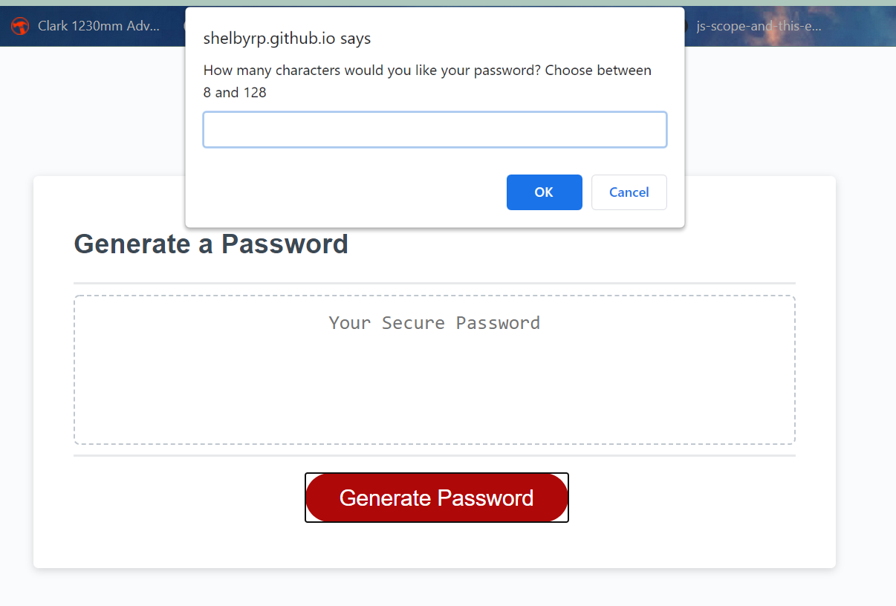
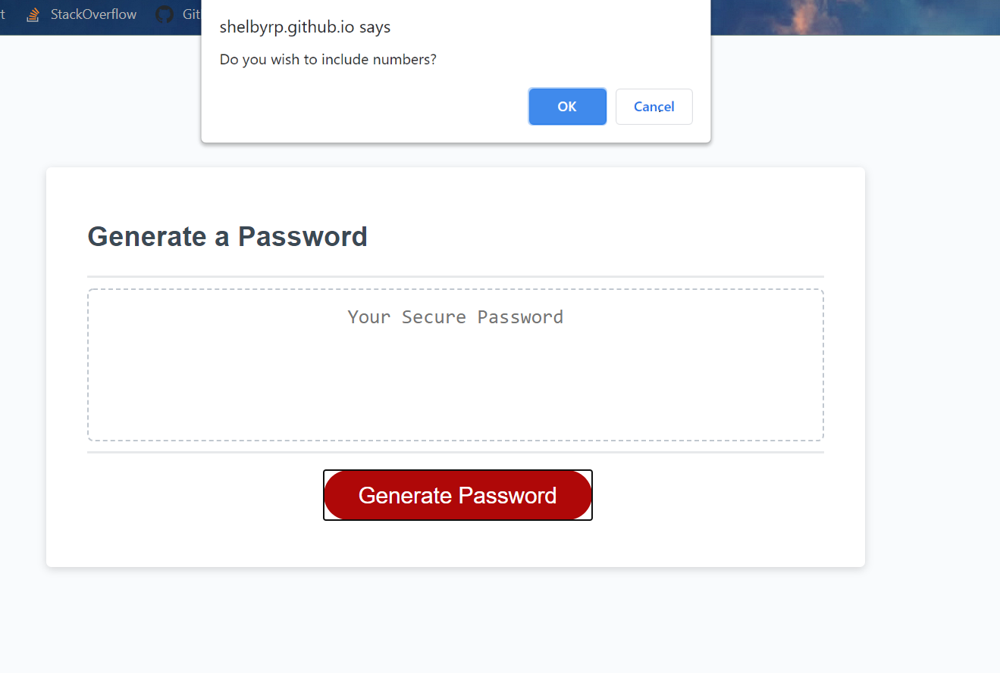
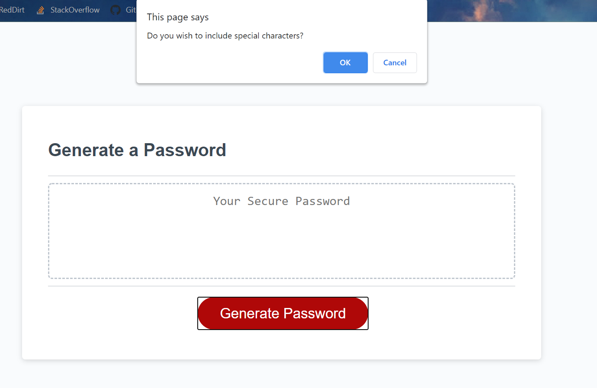
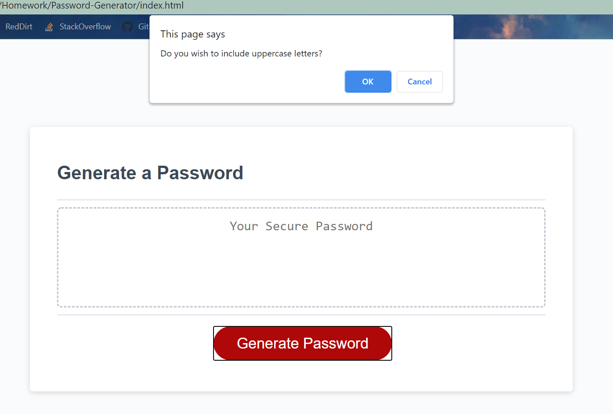
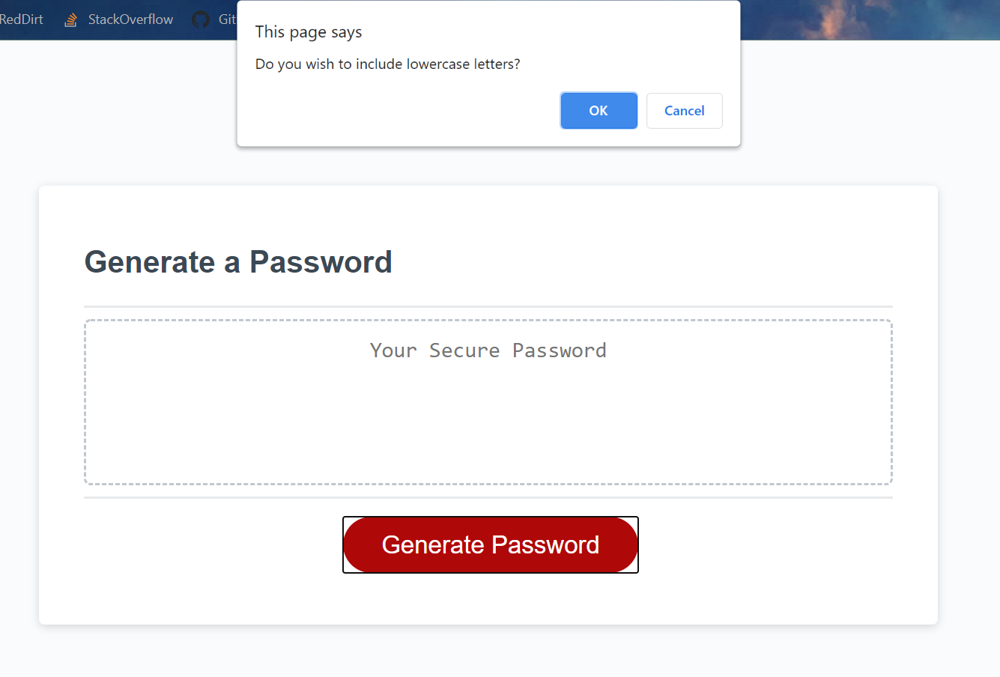

# 03 JavaScript: Password Generator

## This application is a secure password generator, which allows users to create unique passwords based on a set of criteria as selected by the user.  

Additions to the Javascript code allows for the prompts for selection and based on the confirmations, generate a random password. 

Criteria that the user will be prompted to select when they have clicked on the generate password button is as follows:

1. The length of their password. Must be a minimum of 8 characters and a maximum of 128.

2. User is then prompted to select if they would like to include numbers in their password.

3. User is then prompted to select if they would like to include special characters in their password.

4. User is then prompted to select if they would like to include uppercase letters in their password.

5. User is then prompted to select if they would like to include lowercase letters in their password.

Note: if an invalid length of a password is entered, the user will be prompted to enter a valid value or else a password will not be generated. If the user cancels before entering a length, they will be notified that they exited in the application.

Once all criteria is confirmed, a password in generated and displayed on the page for the user to utilse.

Final URL: https://shelbyrp.github.io/Password-Generator/

# License

@ Shelby R Pignat

Licensed under the [MIT](LICENSE) license.

